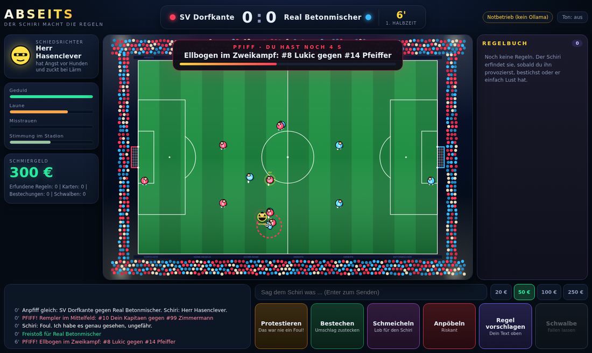
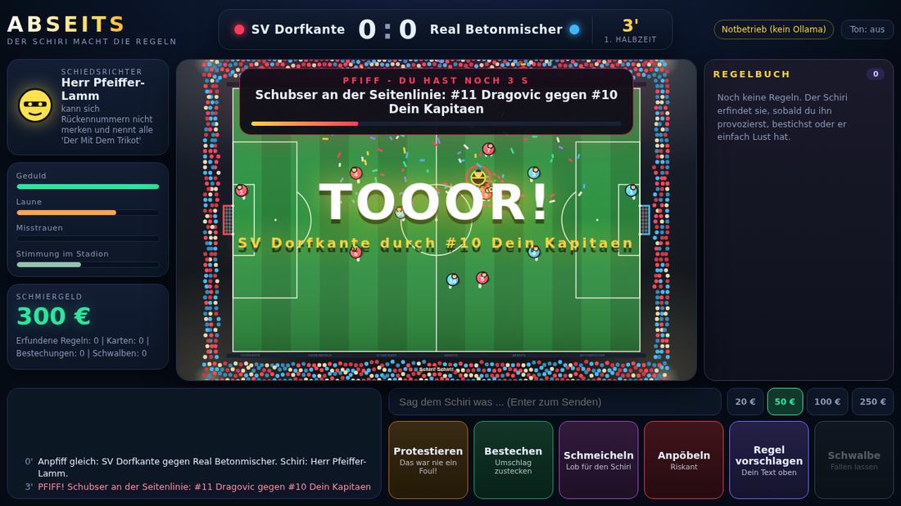

# ABSEITS

Football, but the referee is an AI and makes up the rules as he goes.

You are the captain of SV Dorfkante, playing against Real Betonmischer. The match runs on its own and you watch it from above in your browser. When the referee blows the whistle, you have a few seconds to talk him into something. You can protest, bribe him, flatter him, insult him, or suggest a rule. He decides fresh every time, and sometimes he invents a rule that really applies from then on: goals count double, the ball gets huge, a team freezes, the sides switch.





## How a match works

A match lasts 90 game minutes, which is about six minutes in real time without interruptions. The referee whistles for fouls, handballs, brawls, a streaker, and every goal. Then the game stops:

1. The referee whistles. You have a few seconds to say something. If you do something, he decides right away.
2. He decides: play on, free kick, penalty, goal counts or not, drop ball. Plus cards and a comment.
3. You can protest once more. He might change his mind.

What you can do:

- **Protest**: costs nothing, but annoys him.
- **Bribe**: you have 300 €. He takes the money, turns it down, or takes it and does nothing anyway. The more suspicious he is, the worse your chances.
- **Flatter**: helps if it fits his vanity.
- **Insult**: risky. If his patience hits zero, your captain gets sent off.
- **Suggest a rule**: type it into the text field at the bottom.
- **Dive**: your player drops to the ground. The referee only sometimes notices.

Every referee has a quirk of his own, shown on the left. Whether he can be bribed is not shown anywhere, you have to find out.

## How the referee works

The referee is a language model running locally through Ollama (`qwen2.5:7b`, like in GENESIS). At every whistle and every action of yours he gets the situation: score, minute, the rulebook, what you said, his mood. He answers with JSON: a comment, a decision, maybe a card, maybe a new rule.

The model is not allowed to change the game freely. Every answer is checked before it has any effect. Decisions, cards and rule effects come from a fixed list, numbers are limited, and anything unknown is ignored. Possible rule effects: value of a goal, ball size, ball speed, player speed, goal size, player size, hands allowed, no fouls, switch sides, freeze a team, add or remove a goal. Anything else only becomes a line in the rulebook.

If Ollama is not running or does not answer, the game keeps going anyway. A built-in fallback with fixed comments and a few example rules takes over. The top right of the game shows which mode is active.

## Running it

You need Python 3 and Ollama. There are no packages to install. I tested with Python 3.10.

```sh
ollama pull qwen2.5:7b
ollama serve
```

If Ollama is already running, you can skip `ollama serve`. Then, in the folder of the repo:

```sh
python main.py
```

The browser opens by itself at `http://127.0.0.1:8765/`. The first whistle takes longer because the model has to load first.

Options:

```sh
python main.py --offline        # no Ollama, fallback only
python main.py --no-browser     # don't open the browser automatically
python main.py --port 9000      # different port
```

Everything adjustable is in `config.py`: model, match length, how much time you get after a whistle, how often the referee whistles, starting money, team names.

## Code

- `main.py`: starts the server and opens the browser.
- `server.py`: small local web server, only on your own machine.
- `engine.py`: pitch, players, ball, whistles, cards, rules, your actions.
- `referee.py`: the request to Ollama, checking the answer, and the fallback.
- `static/`: the interface (HTML, CSS and `game.js`, drawn on a canvas).
- `tests/`: tests that run without Ollama and without a browser.

```sh
python -m unittest discover -s tests -v
```

## What is still open

The tests cover the game, the rules, the checking of answers and the fallback. So far I have only tested the Ollama part against a fake Ollama server, not against the real `qwen2.5:7b`. How good the comments and rules really are, and how long an answer takes on your graphics card, will show when you first play it. A 7B model can also produce nonsense. If that happens, a bigger model in `config.py` helps.

Sound is off by default (button at the top right). The interface was checked in Chrome, not in other browsers.

The server only listens on `127.0.0.1`. No data is sent anywhere except to your local Ollama.
